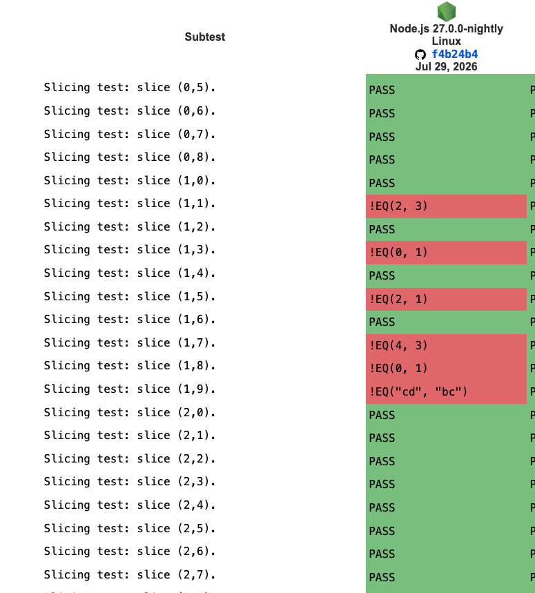

## 문제

`Blob.prototype.slice()` 메서드에 대한 WPT 테스트가 실패하는 케이스가 존재하여 이를 해결하고자 하였습니다.



테스트가 실패하는 케이스는 총 6가지 정도 존재하였습니다.

| WPT 이름 | 실제 호출 | `[Clamp]` 변환 | 표준 기대값 | 기존 Node.js 결과 |
|---|---|---|---|---|
| `slice(1,1)` | `blob.slice(1.5)` | `1.5 → 2` | `"cd"` | `"bcd"` |
| `slice(1,3)` | `blob.slice(3.5)` | `3.5 → 4` | `""` | `"d"` |
| `slice(1,5)` | `blob.slice(0, 1.5)` | `1.5 → 2` | `"ab"` | `"a"` |
| `slice(1,7)` | `blob.slice(0, 3.5)` | `3.5 → 4` | `"abcd"` | `"abc"` |
| `slice(1,8)` | `blob.slice(1.5, 2.5)` | `1.5 → 2`, `2.5 → 2` | `""` | `"b"` |
| `slice(1,9)` | `blob.slice(1.5, 3.5)` | `1.5 → 2`, `3.5 → 4` | `"cd"` | `"bc"` |

이에 대해 Blob 객체에 대한 Web IDL(Interface Definition Language) 표준과 Node.js 구현체를 비교하여 테스트 실패에 대한 원인을 확인하고 개선시키고자 하였습니다.


## 해결

##### 표준과 구현의 차이

[Blob Web IDL](https://www.w3.org/TR/FileAPI/#blob-section) 표준을 확인하면 다음과 같이 정의되어 있습니다.

```js
interface Blob {
  constructor(optional sequence<BlobPart> blobParts,
              optional BlobPropertyBag options = {});

  readonly attribute unsigned long long size;
  readonly attribute DOMString type;

  // slice Blob into byte-ranged chunks
  Blob slice(optional [Clamp] long long start,
            optional [Clamp] long long end,
            optional DOMString contentType);

  // read from the Blob.
  [NewObject] ReadableStream stream();
  [NewObject] Promise<USVString> text();
  [NewObject] Promise<ArrayBuffer> arrayBuffer();
  [NewObject] ReadableStream textStream();
  [NewObject] Promise<Uint8Array> bytes();
};
```

여기서 WPT 테스트에서 실패했던 부분은 `slice()` 메서드에 해당하는 경우이며, 위 표준에서 해당 함수의 시그니처는 다음과 같습니다.

```js
// slice Blob into byte-ranged chunks
Blob slice(optional [Clamp] long long start,
          optional [Clamp] long long end,
          optional DOMString contentType);
```

- `start`: optional, long long, clamp
- `end`: optional, long long, clamp
- `contentType`: optional, DomString

1. `start`, `end`, `contentType`은 모두 optional하며 null로 받는다.
2. `start`를 받으면 해당 값부터 자른다.
3. `end`를 받으면 해당 값 앞까지 자른다.
4. `contentType`은 Blob 객체의 type값을 설정한다.

이에 대해 실제 Node.js는 다음과 같이 구현되어 있었다.

```js
/~**
  * @param {number} [start]
  * @param {number} [end]
  * @param {string} [contentType]
  * @returns {Blob}
  */
slice(start = 0, end = this[kLength], contentType = '') {
  if (!isBlob(this))
    throw new ERR_INVALID_THIS('Blob');

  start = converters['long long'](
    start,
    { __proto__: null, context: 'start' },
  );
  end = converters['long long'](
    end,
    { __proto__: null, context: 'end' },
  );

  if (start < 0) {
    start = MathMax(this[kLength] + start, 0);
  } else {
    start = MathMin(start, this[kLength]);
  }

  if (end < 0) {
    end = MathMax(this[kLength] + end, 0);
  } else {
    end = MathMin(end, this[kLength]);
  }

  contentType = `${contentType}`;
  if (RegExpPrototypeExec(disallowedTypeCharacters, contentType) !== null) {
    contentType = '';
  } else {
    contentType = StringPrototypeToLowerCase(contentType);
  }

  const span = MathMax(end - start, 0);

  return createBlob(
    this[kHandle].slice(start, start + span),
    span,
    contentType);
}
```

`start`와 `end` 값을 받아서 각 타입에 맞게끔 변환을 해주고 간단한 validation과 `contentType`을 설정하여 새로운 `Blob` 객체를 생성하여 반환해준다.

여기서 표준에서 확인하였을 때 **`start`와 `end`는 optional, long long, clamp라는 조건이 있었는데 실제 구현체에서는 clamp의 조건이 존재하지 않다는 것**을 발견하였다.

#### Clamp

[Clamp](http://webidl.spec.whatwg.org/#Clamp)는 Web IDL의 확장 속성이다. Web IDL 정수 타입에 지정하면 JavaScript Number를 해당 IDL 타입으로 변환할 때, 일반 정수 변환의 모듈로 연산 대신 범위를 벗어난 값을 유효 범위의 최솟값 또는 최댓값으로 제한한다.

예를 들어, RGB 값을 정할 때도 정해진 정수의 범위가 있다.

```js
// Calling the non-[Clamp] version uses ToUint8 to coerce the Numbers to octets.
// This is equivalent to calling setColor(255, 255, 1).
context.setColor(-1, 255, 257);

// Call setColorClamped with some out of range values.
// This is equivalent to calling setColorClamped(0, 255, 255).
context.setColorClamped(-1, 255, 257);
```

정해진 범위를 벗어난 정수를 전달했을 때 [Clamp]가 없다면 ToUint8 변환은 모듈로 연산을 적용한다. 따라서 -1은 255, 257은 1처럼 값이 범위 안에서 순환한다. 

반면 [Clamp]를 적용하면 범위를 벗어난 값을 최솟값 또는 최댓값으로 제한하므로, -1은 0, 257은 255로 변환된다. 이를 통해 범위를 벗어난 입력을 더 직관적인 경계값으로 처리할 수 있다.

#### Clamp 적용

다행히 Node.js에서 clamp 속성에 대해 구현이 되어 있기에, 속성의 값만 추가해주면 되었다.

```diff
start = converters['long long'](
  start,
- { __proto__: null, context: 'start' },
+ { __proto__: null, context: 'start', clamp: true },
);

end = converters['long long'](
  end,
- { __proto__: null, context: 'end' },
+ { __proto__: null, context: 'end', clamp: true },
);
```

전달할 수 있는 option의 값으로는 다음과 같이 제공해주었다.

```js
/**
 * @typedef {object} ConversionOptions
 * @property {string} [prefix] Message prefix for operation failures.
 * @property {string} [context] Message context for the converted value.
 * @property {string} [code] Node.js error code to assign to TypeError.
 * @property {boolean} [enforceRange] Web IDL [EnforceRange] attribute.
 * @property {boolean} [clamp] Web IDL [Clamp] attribute.
 * @property {boolean} [allowShared] Web IDL [AllowShared] attribute for
 *   buffer view types.
 * @property {boolean} [allowResizable] Web IDL [AllowResizable] attribute.
 */
```

`converters['long long']` 객체는 해당 값을 long long 타입의 정수로 변환이 되도록 함수를 실행하는데, 내부적으로 받은 `ConversionOptions` 값을 통해 값을 변환하는 과정이 달라진다.

이 때 Clamp가 설정되어 있다면 여러가지 조건에 따라 범위 내 값을 반환해준다.

1. 범위 안 정수: 그대로 반환
2. 범위 안 소수: 가장 가까운 정수로 반올림. 중간값은 짝수 선택
3. 범위 밖 값: 최솟값 또는 최댓값으로 제한
4. NaN: 0 반환

## 검증

해당 테스트 파일에 대해서 실행해보고 전체 wpt/test-blob에 대해서도 테스트를 진행하여 기존 fail하던 테스트가 통과되는 것을 확인하였다.

```
$ ./node test/wpt/test-blob.js Blob-slice.any.js

Files: 1/1 ran, 1 passed, 0 skipped, 0 expected failures, 0 unexpected failures, 0 unexpected passes
Subtests: 150 passed, 0 skipped, 0 expected failures, 0 unexpected failures, 0 unexpected passes
```

```
$ tools/test.py wpt/test-blob

[00:00|% 100|+   1|-   0]: Done
```
