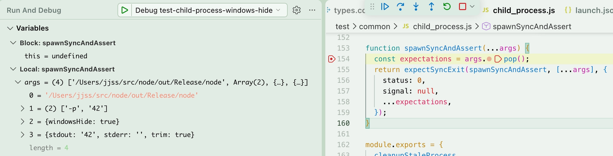
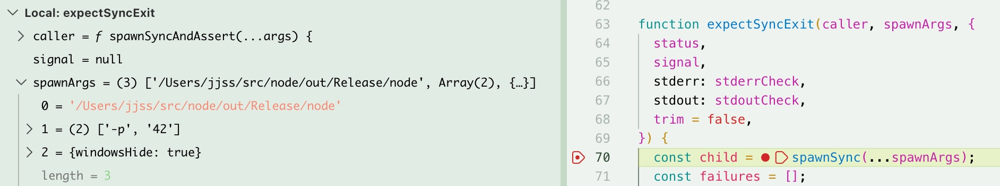

## 문제

수정 이전 코드는, 예를 들어 CI 과정 중 첫 번째 assert  `assert.strictEqual(child.status, 0);` 에서 오류가 발생할 경우 그 뒤 assert문의 값을 확인할 수 없다는 문제가 있었습니다.

## 해결

spawnSync()로 child를 생성하고, status, signal, stdout, .. 등의 값을 일일이 assert하는 코드를 수정하여 `spawnSyncAndAssert()`를 사용하도록 했습니다.

`spawnSyncAndAssert()` 는 모든 assert 대상의 값을 한번에 확인할 수 있도록 하는 헬퍼 함수입니다.

sync spawn 함수에 대해서만 헬퍼가 존재하므로 다른 부분(async)은 수정하지 않고 PR을 제출했습니다.

## 검증

breakpoint를 걸고 디버깅을 진행해보았습니다.

`spawnSyncAndAssert`에서 `args`의 마지막 값 `{stdout: ‘42’, stderr: ‘’, trim: true}` 만 pop하고, 나머지 `args`를 다시 `expectSyncExit`에 인자로 보냅니다. `expectSyncExit`이 잘 받았음을 확인할 수 있습니다.

`expectSyncExit`이 받은 `args` 인자들은 코드 수정 이전 `const child = cp.spawnSync(cmd, args, options);` 와 일치하므로, 헬퍼 함수가 `spawnSync()`에게 리팩토링 이전과 동일하게 인자를 전달함을 확인할 수 있습니다.
