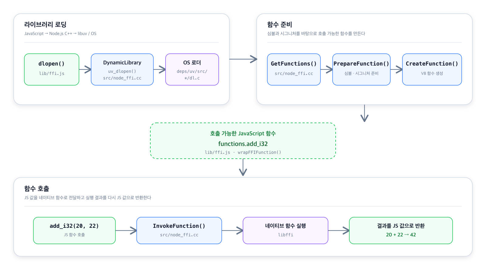

<!-- 아래 양식은 작성 예시입니다. 필요에 따라 자유롭게 수정해 주세요. -->

## 문제 내용

`node:ffi` 모듈에 대해 학습을 진행하고 학습한 내용을 바탕으로 기여해볼 수 있는 이슈들을 확인해보다가, 그 동안 `typings`에 기여하였던 경험들을 바탕으로 `internal('ffi')`에서 호출하는 메서드 및 변수들에 대한 타입을 정의하여 기여해보기로 결정하였습니다.

## 해결 과정과 검증

### FFI의 간단한 흐름

**1. `dlopen()`을 통해 동적 라이브러리 로딩**
	- `dlopen()`을 통해 파일의 `path`와 함수 시그니처인 `definitions`를 전달
    - libuv 외부 라이브러리를 통해 OS 환경에 따라 서로 다른 동적 라이브러리 로더를 호출하여 `path`의 파일을 로딩

**2. 함수 파싱 및 생성**
	- 전달된 함수 시그니처를 토대로 함수를 파싱하고 JS에서 사용할 수 있는 V8 함수를 생성합니다.
    - `get` > `prepare` > `create` 순서를 거치며 함수를 파싱하고 생성
    - `GetFunctions()`: 전달받은 함수 시그니처의 형식을 검사하고 `PrepareFunction`, `CreateFunction`을 호출.
    - `PrepareFunction()`: 함수 시그니처를 파싱 & libffi ABI 규약 확인
    - `CreateFunction()`:JS에서 호출이 가능하도록 V8 함수로 생성
    

**3. 함수 호출**
	- `handler.functions.{name}` 과 같은 형식으로 호출 가능
    - 이를 호출하면`InvokeFunction()`으로 네이티브 함수가 콜백을 받아서 실행
    - 네이티브 함수에서 연산된 값을 JS로 반환

### 타입 정의

타입을 정의할 때, [Node.js FFI 공식문서](https://nodejs.org/api/ffi.html#ffi)를 많이 참고하였습니다. Javascript에서 제공하는 타입과 네이티브에서 사용하는 타입이 크다보니, 이를 적절히 타입을 매칭해야 하는 작업이 번거로웠는데 공식문서에서 참고할 수 있는 내용들이 있어 도움을 많이 받을 수 있었습니다.

예를 들어, FFI에서는 함수(심볼)을 저장하는 메모리 주소를 자바스크립트와 네이티브 영역이 자주 주고 받는데 `Pointer`에 해당하는 메모리 주소는 2^53 - 1까지 정확히 표현이 가능한 자바스크립트의 `Number` 타입으로 표현이 어려울 수 있기 때문에 `bigint` 타입을 사용해야 했습니다.

이 뿐만 아니라 FFI Public API가 제공하는 함수의 시그니처가 FFI 내부 함수의 시그니처와 동일한 경우도 많아, 참고할 수 있었던 내용돌이 많았습니다. (`DynamicLibrary`, `native functions`, `toString()`, `toBuffer()` 등등..)

## 기여 회고

`ffi`를 자바스크립트 코드에서 호출하는 것부터 실제 네이티브 코드까지 데이터가 어떻게 전달되고 반환된 값을 어떻게 받아오는 지를 스스로 정리해보며 타입을 정의하는 과정은 크게 어렵지 않았지 않았습니다. 하지만 이 모듈은 아직 experimental한 상태이고 현재 활발하게 작업이 되며 업데이트가 되고 있는 상황이기 때문에 미리 타입을 정의해둔 것이 오히려 개발의 발목을 잡을 수도 있지 않을까? 라는 생각이 들기도 하였습니다. 

실제로도 PR을 올리자마자 이와 관련된 리뷰가 5분만에 달렸습니다.

> cc @nodejs/ffi are these typings accurate? will you remember to keep the typings up to date? it's undergoing very active development so might as well be the case that in-flight changes may invalidate this very proposed state.

실제 이 타이핑이 정확하게 정의가 되어있는지, 현재 활발히 개발 중이라 이 기여가 의미가 없어질 수도 있는데 계속 최신화시켜줄 수 있는지에 대해서 물어보는 리뷰였습니다.

그럼에도 처음 멘토님께서 `typing` 관련된 아이디어를 공유해주셨을 때도, 이 기여의 목적은 개발자들의 개발 편의성을 높여주기 위한 것이라는 것이라는 것에 공감하였기에 다음과 같이 답글을 달았습니다.

> Thanks for raising this. I'm aware that the FFI module is under active development, which I considered before opening this PR. I decided to type the current implementation because having typings—even at this early stage-significantly improves the developer experience.
That said, would you prefer holding off on merging these until the API stabilizes further?

이런 상황들을 이해하고 PR을 올리기 전에 고민하였지만 오히려 타입을 정의해주는 것이 개발자들의 편의성을 높여주는 것이라 생각한다고 이야기를 하였고, 더 안정화가 되기 전까지 작업을 진행하지 않는 것이 좋을 것이라 생각하는 지에 대해 물어보았습니다.

> @HoonDongKang No, I think we need a starting point anyway. And lately the FFI API has been pretty stable TBH.

하지만 다른 리뷰어분께서 다행히 FFI API가 어느 정도 안정화가 되었고 시발점이 필요할 것 같다고 제안을 해주셔서 성공적으로 approve를 받을 수 있었습니다.

기여하고자 하는 마음도 컸지만 기여의 목적보다 학습한 내용을 복습하며 정리할 수 있었던 내용들이 더 많았기에, 밑져야 본전이라는 생각으로 작업을 먼저 진행하고 PR을 올리면서 제안해볼 수 있었던 것 같습니다. 이걸 과연 해도 되나? 싶은 생각이 들더라도, 먼저 제안하고 리뷰를 받으면서 모두가 합의하는 방향으로 이끌어나가는 것이 오픈 소스의 매력이라는 것을 다시 한 번 더 느낄 수 있었습니다.

